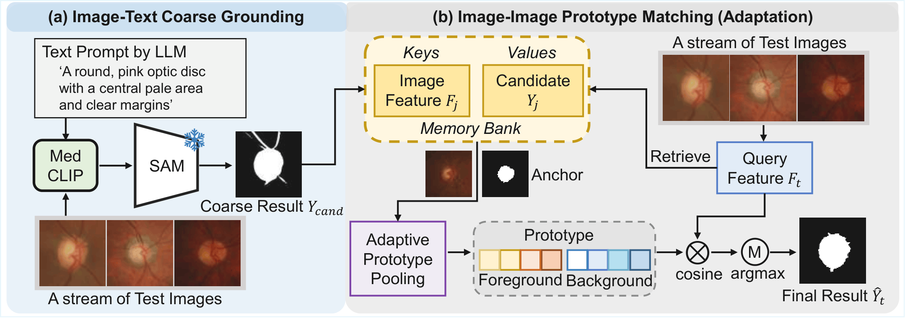

# :page_facing_up: MSSA
This is the official PyTorch implementation of our ECCV 2026 paper "[Memory-Supported Synergistic Adaptation
for Training-Free Test-Time Medical Image Segmentation](https://arxiv.org/pdf/2607.17693)".

<div align="center">
  
</div>

## Environment
```
CUDA 10.1
Python 3.7.0
Pytorch 1.8.0
CuDNN 8.0.5
```
Our Anaconda environment is also available for download from [Google Drive](https://drive.google.com/file/d/1fmqEl5HDHjuQ3Ih4vD81B0xOHC5fLSE7/view?usp=drive_link).

Upon decompression, please move ```mssa``` to ```your_root/anaconda3/envs/```. Then the environment can be activated by ```conda activate mssa```.

## Data Preparation
The preprocessed fundus data can be downloaded from [Google Drive](https://drive.google.com/drive/folders/1axgu3-65un-wA_1OH-tQIUIEHEDrnS_-?usp=drive_link).

## Pre-trained Models
Download SAM vit_h Model from [Google Drive](https://dl.fbaipublicfiles.com/segment_anything/sam_vit_h_4b8939.pth) and drag it into the checkpoint folder.
Download MedSAM_CLIP fine-tuned BiomedCLIP Model from [Google Drive](https://drive.google.com/file/d/1jjnZabUlc9_gpcP0d2nz_GNS-EGX0lq5/view?usp=sharing) and drag it into the checkpoint folder.


* **OD Segmentation**
```
python ours.py \
    --input "${INPUT_DIR}" \
    --output "${OUTPUT_ROOT}" \
    --gt-dir "${GT_DIR}" \
    --sam-checkpoint "${SAM_CHECKPOINT}" \
    --sam-model-type vit_h \
    --clip-model-path "${CLIP_MODEL_PATH}" 
```
* **Lung Segmentation**
```
python ours.py \
    --input "${INPUT_DIR}" \
    --output "${OUTPUT_ROOT}" \
    --gt-dir "${GT_DIR}" \
    --sam-checkpoint "${SAM_CHECKPOINT}" \
    --sam-model-type vit_h \
    --clip-model-path "${CLIP_MODEL_PATH}" 
```

## How to Run
Please first modify the root in ```MSSA_OD.sh``` and ```MSSA_Lung.sh```, and then run the following command.
```
# On the OD segmentation task
bash MSSA_OD.sh
# On the lung segmentation task
bash MSSA_Lung.sh
```

## Citation ✏️
If this code is helpful for your research, please cite:
```
@article{li2026memory,
  title={Memory-Supported Synergistic Adaptation for Training-Free Test-Time Medical Image Segmentation},
  author={Li, Lingrui and Pu, Nan and Zhao, Dong and Li, Wenjing and French, Andrew P and Zhong, Zhun and Chen, Xin},
  journal={arXiv preprint arXiv:2607.17693},
  year={2026}
}
```
## Acknowledgement
Our code is adapted from the PyTorch implementations of [MedClipSAMv2](https://github.com/HealthX-Lab/MedCLIP-SAMv2).

## Contact
Lingrui Li (lingrui.li@nottingham.ac.uk)
